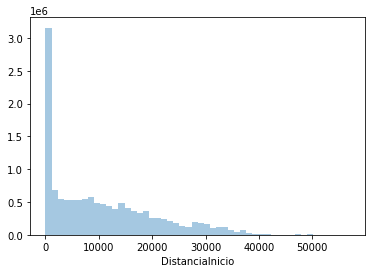
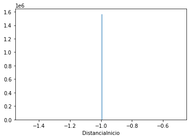
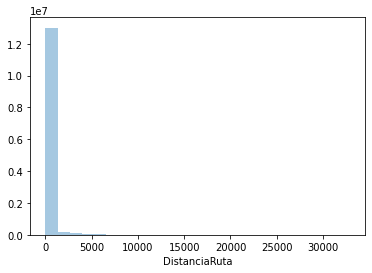

```python
import pandas as pd
import numpy as np
import os
import seaborn as sns
```


```python
print("numpy version: ", np.__version__)
print("pandas version: ", pd.__version__)
```

    numpy version:  1.19.2
    pandas version:  1.1.2


```python
data_folder = "/mnt/d/Descargas/datos_gps_curso_ciencia_de_datos"
shape = "/2019-07-01.shape"
stop = "/2019-07-01.stop"
gps = "/2019-08-01.gps"
```

# Lectura de datos


```python
shape = pd.read_csv(data_folder+shape, sep="|")
shape
```


<div>
<style scoped>
    .dataframe tbody tr th:only-of-type {
        vertical-align: middle;
    }

    .dataframe tbody tr th {
        vertical-align: top;
    }

    .dataframe thead th {
        text-align: right;
    }
</style>
<table border="1" class="dataframe">
  <thead>
    <tr style="text-align: right;">
      <th></th>
      <th>Servicio</th>
      <th>EsSeccionIni</th>
      <th>Latitud</th>
      <th>Longitud</th>
      <th>Operador</th>
      <th>ServicioUsuario</th>
    </tr>
  </thead>
  <tbody>
    <tr>
      <th>0</th>
      <td>B01 00I</td>
      <td>1</td>
      <td>-33.400169</td>
      <td>-70.620153</td>
      <td>6</td>
      <td>B01</td>
    </tr>
    <tr>
      <th>1</th>
      <td>B01 00I</td>
      <td>0</td>
      <td>-33.400083</td>
      <td>-70.620549</td>
      <td>6</td>
      <td>B01</td>
    </tr>
    <tr>
      <th>2</th>
      <td>B01 00I</td>
      <td>0</td>
      <td>-33.400909</td>
      <td>-70.623564</td>
      <td>6</td>
      <td>B01</td>
    </tr>
    <tr>
      <th>3</th>
      <td>B01 00I</td>
      <td>0</td>
      <td>-33.400127</td>
      <td>-70.625097</td>
      <td>6</td>
      <td>B01</td>
    </tr>
    <tr>
      <th>4</th>
      <td>B01 00I</td>
      <td>1</td>
      <td>-33.398604</td>
      <td>-70.628080</td>
      <td>6</td>
      <td>B01</td>
    </tr>
    <tr>
      <th>...</th>
      <td>...</td>
      <td>...</td>
      <td>...</td>
      <td>...</td>
      <td>...</td>
      <td>...</td>
    </tr>
    <tr>
      <th>105172</th>
      <td>T558 00R</td>
      <td>1</td>
      <td>-33.537108</td>
      <td>-70.788154</td>
      <td>5</td>
      <td>118</td>
    </tr>
    <tr>
      <th>105173</th>
      <td>T558 00R</td>
      <td>0</td>
      <td>-33.538915</td>
      <td>-70.786178</td>
      <td>5</td>
      <td>118</td>
    </tr>
    <tr>
      <th>105174</th>
      <td>T558 00R</td>
      <td>1</td>
      <td>-33.540085</td>
      <td>-70.784898</td>
      <td>5</td>
      <td>118</td>
    </tr>
    <tr>
      <th>105175</th>
      <td>T558 00R</td>
      <td>0</td>
      <td>-33.541946</td>
      <td>-70.787587</td>
      <td>5</td>
      <td>118</td>
    </tr>
    <tr>
      <th>105176</th>
      <td>T558 00R</td>
      <td>1</td>
      <td>-33.542444</td>
      <td>-70.788307</td>
      <td>5</td>
      <td>118</td>
    </tr>
  </tbody>
</table>
<p>105177 rows × 6 columns</p>
</div>


```python
stop = pd.read_csv(data_folder+stop, sep="|")
stop
```


<div>
<style scoped>
    .dataframe tbody tr th:only-of-type {
        vertical-align: middle;
    }

    .dataframe tbody tr th {
        vertical-align: top;
    }

    .dataframe thead th {
        text-align: right;
    }
</style>
<table border="1" class="dataframe">
  <thead>
    <tr style="text-align: right;">
      <th></th>
      <th>Servicio</th>
      <th>ServicioUsuario</th>
      <th>Operador</th>
      <th>Correlativo</th>
      <th>Codigo</th>
      <th>CodigoUsuario</th>
      <th>Nombre</th>
      <th>Latitud</th>
      <th>Longitud</th>
      <th>esZP</th>
    </tr>
  </thead>
  <tbody>
    <tr>
      <th>0</th>
      <td>T461 00I</td>
      <td>101I</td>
      <td>4</td>
      <td>0</td>
      <td>T-4-25-OP-5</td>
      <td>PB1</td>
      <td>Venezuela / esq. Bolivia</td>
      <td>-33.404568</td>
      <td>-70.623095</td>
      <td>0</td>
    </tr>
    <tr>
      <th>1</th>
      <td>T461 00I</td>
      <td>101I</td>
      <td>4</td>
      <td>1</td>
      <td>T-4-25-OP-10</td>
      <td>PB2</td>
      <td>Venezuela / esq. H. de La Concepción</td>
      <td>-33.402465</td>
      <td>-70.626647</td>
      <td>0</td>
    </tr>
    <tr>
      <th>2</th>
      <td>T461 00I</td>
      <td>101I</td>
      <td>4</td>
      <td>2</td>
      <td>T-4-24-OP-5</td>
      <td>PB3</td>
      <td>Reina de Chile / esq. Avenida El Salto</td>
      <td>-33.401225</td>
      <td>-70.629742</td>
      <td>0</td>
    </tr>
    <tr>
      <th>3</th>
      <td>T461 00I</td>
      <td>101I</td>
      <td>4</td>
      <td>3</td>
      <td>T-4-23-OP-5</td>
      <td>PB4</td>
      <td>Pedro Donoso / esq.  Santa Ana</td>
      <td>-33.399234</td>
      <td>-70.632984</td>
      <td>0</td>
    </tr>
    <tr>
      <th>4</th>
      <td>T461 00I</td>
      <td>101I</td>
      <td>4</td>
      <td>4</td>
      <td>T-4-23-OP-10</td>
      <td>PB5</td>
      <td>Pedro Donoso / esq.  María del Pilar</td>
      <td>-33.398345</td>
      <td>-70.636816</td>
      <td>0</td>
    </tr>
    <tr>
      <th>...</th>
      <td>...</td>
      <td>...</td>
      <td>...</td>
      <td>...</td>
      <td>...</td>
      <td>...</td>
      <td>...</td>
      <td>...</td>
      <td>...</td>
      <td>...</td>
    </tr>
    <tr>
      <th>44508</th>
      <td>T540 00I</td>
      <td>J20I</td>
      <td>5</td>
      <td>43</td>
      <td>L-11-30-20-SN</td>
      <td>PJ1940</td>
      <td>Serrano / esq. Cultura</td>
      <td>-33.418501</td>
      <td>-70.763113</td>
      <td>0</td>
    </tr>
    <tr>
      <th>44509</th>
      <td>T540 00I</td>
      <td>J20I</td>
      <td>5</td>
      <td>44</td>
      <td>L-11-30-35-SN</td>
      <td>PJ1943</td>
      <td>Serrano / esq. La Capilla</td>
      <td>-33.414984</td>
      <td>-70.763171</td>
      <td>0</td>
    </tr>
    <tr>
      <th>44510</th>
      <td>T540 00I</td>
      <td>J20I</td>
      <td>5</td>
      <td>45</td>
      <td>L-11-5-5-PO</td>
      <td>PJ257</td>
      <td>La Capilla / esq. Fraternidad</td>
      <td>-33.414452</td>
      <td>-70.762472</td>
      <td>0</td>
    </tr>
    <tr>
      <th>44511</th>
      <td>T540 00I</td>
      <td>J20I</td>
      <td>5</td>
      <td>46</td>
      <td>T-11-85-PO-3</td>
      <td>PJ258</td>
      <td>La Capilla esq. / Federico Errázuriz</td>
      <td>-33.414439</td>
      <td>-70.760214</td>
      <td>0</td>
    </tr>
    <tr>
      <th>44512</th>
      <td>T540 00I</td>
      <td>J20I</td>
      <td>5</td>
      <td>47</td>
      <td>T-11-85-PO-5</td>
      <td>PJ259</td>
      <td>La Capilla / esq. El Arrollo</td>
      <td>-33.414384</td>
      <td>-70.756460</td>
      <td>0</td>
    </tr>
  </tbody>
</table>
<p>44513 rows × 10 columns</p>
</div>


```python
headers = ["Patente", "Servicio", "GPS_time", "Latitud", "Longitud", "DistanciaInicio", "DistanciaRuta", "Ind1", "Ind2", "Ind3"]
```


```python
gps = pd.read_csv(data_folder+gps, sep=";", names=headers)
gps
```


<div>
<style scoped>
    .dataframe tbody tr th:only-of-type {
        vertical-align: middle;
    }

    .dataframe tbody tr th {
        vertical-align: top;
    }

    .dataframe thead th {
        text-align: right;
    }
</style>
<table border="1" class="dataframe">
  <thead>
    <tr style="text-align: right;">
      <th></th>
      <th>Patente</th>
      <th>Servicio</th>
      <th>GPS_time</th>
      <th>Latitud</th>
      <th>Longitud</th>
      <th>DistanciaInicio</th>
      <th>DistanciaRuta</th>
      <th>Ind1</th>
      <th>Ind2</th>
      <th>Ind3</th>
    </tr>
  </thead>
  <tbody>
    <tr>
      <th>0</th>
      <td>2_FLXS-93</td>
      <td></td>
      <td>2019-02-06 20:16:24</td>
      <td>-33.453564</td>
      <td>-70.763113</td>
      <td>-1</td>
      <td>-1</td>
      <td>7</td>
      <td>5</td>
      <td>0</td>
    </tr>
    <tr>
      <th>1</th>
      <td>FLXH-41</td>
      <td></td>
      <td>2019-07-31 23:59:59</td>
      <td>-33.452271</td>
      <td>-70.558766</td>
      <td>-1</td>
      <td>-1</td>
      <td>18</td>
      <td>4</td>
      <td>0</td>
    </tr>
    <tr>
      <th>2</th>
      <td>CJJW-58</td>
      <td>B01 00I</td>
      <td>2019-08-01 00:00:00</td>
      <td>-33.385337</td>
      <td>-70.696805</td>
      <td>10081</td>
      <td>42</td>
      <td>0</td>
      <td>13</td>
      <td>4</td>
    </tr>
    <tr>
      <th>3</th>
      <td>CJJW-58</td>
      <td>B01 00I</td>
      <td>2019-08-01 00:00:30</td>
      <td>-33.385337</td>
      <td>-70.696805</td>
      <td>10081</td>
      <td>42</td>
      <td>0</td>
      <td>13</td>
      <td>4</td>
    </tr>
    <tr>
      <th>4</th>
      <td>CJJW-58</td>
      <td>B01 00I</td>
      <td>2019-08-01 00:01:00</td>
      <td>-33.385337</td>
      <td>-70.696805</td>
      <td>10081</td>
      <td>42</td>
      <td>0</td>
      <td>13</td>
      <td>4</td>
    </tr>
    <tr>
      <th>...</th>
      <td>...</td>
      <td>...</td>
      <td>...</td>
      <td>...</td>
      <td>...</td>
      <td>...</td>
      <td>...</td>
      <td>...</td>
      <td>...</td>
      <td>...</td>
    </tr>
    <tr>
      <th>13392575</th>
      <td>FLXV-45</td>
      <td>T5TS 00R</td>
      <td>2019-08-01 23:59:25</td>
      <td>-33.470534</td>
      <td>-70.762606</td>
      <td>-1</td>
      <td>-1</td>
      <td>0</td>
      <td>5</td>
      <td>0</td>
    </tr>
    <tr>
      <th>13392576</th>
      <td>FLXW-54</td>
      <td>T5TS 00R</td>
      <td>2019-08-01 23:58:20</td>
      <td>-33.525502</td>
      <td>-70.695188</td>
      <td>-1</td>
      <td>-1</td>
      <td>49</td>
      <td>5</td>
      <td>0</td>
    </tr>
    <tr>
      <th>13392577</th>
      <td>FLXW-54</td>
      <td>T5TS 00R</td>
      <td>2019-08-01 23:58:50</td>
      <td>-33.522828</td>
      <td>-70.698775</td>
      <td>-1</td>
      <td>-1</td>
      <td>53</td>
      <td>5</td>
      <td>0</td>
    </tr>
    <tr>
      <th>13392578</th>
      <td>FLXW-54</td>
      <td>T5TS 00R</td>
      <td>2019-08-01 23:59:20</td>
      <td>-33.520410</td>
      <td>-70.702130</td>
      <td>-1</td>
      <td>-1</td>
      <td>49</td>
      <td>5</td>
      <td>0</td>
    </tr>
    <tr>
      <th>13392579</th>
      <td>FLXW-54</td>
      <td>T5TS 00R</td>
      <td>2019-08-01 23:59:50</td>
      <td>-33.518939</td>
      <td>-70.706203</td>
      <td>-1</td>
      <td>-1</td>
      <td>49</td>
      <td>5</td>
      <td>0</td>
    </tr>
  </tbody>
</table>
<p>13392580 rows × 10 columns</p>
</div>


# Eliminación de columnas no relevantes

Se eliminan las columnas Operador, el cual consiste en la codificación de la empresa a la que pertenece el operador, y ServicioUsuario, el cual es el código de ruta que ve el usuario en la calle (equivalente a Servicio)

EsSeccionIni se queda por el momento


```python
shape = shape.drop(columns=["Operador", "ServicioUsuario"])
```

Se eliminan las columnas ServicioUsuario (equivalente a Servicio), Operador, Código (equivalente a CodigoUsuario), Nombre (nombre de la parada, equivalente a CodigoUsuario) y esZP


```python
stop = stop.drop(columns=["ServicioUsuario", "Operador", "Codigo", "Nombre", "esZP"])
```


```python
gps = gps.drop(columns=["Ind1", "Ind2", "Ind3"])
```

# Visualización

### Shape

Puntos en la ruta pertenecientes a cada servicio

- Hay entre 13 y 255 puntos para los servicios (1428 servicios distintos)
- No existen datos nulos o string vacíos


```python
shape
```


<div>
<style scoped>
    .dataframe tbody tr th:only-of-type {
        vertical-align: middle;
    }

    .dataframe tbody tr th {
        vertical-align: top;
    }

    .dataframe thead th {
        text-align: right;
    }
</style>
<table border="1" class="dataframe">
  <thead>
    <tr style="text-align: right;">
      <th></th>
      <th>Servicio</th>
      <th>EsSeccionIni</th>
      <th>Latitud</th>
      <th>Longitud</th>
    </tr>
  </thead>
  <tbody>
    <tr>
      <th>0</th>
      <td>B01 00I</td>
      <td>1</td>
      <td>-33.400169</td>
      <td>-70.620153</td>
    </tr>
    <tr>
      <th>1</th>
      <td>B01 00I</td>
      <td>0</td>
      <td>-33.400083</td>
      <td>-70.620549</td>
    </tr>
    <tr>
      <th>2</th>
      <td>B01 00I</td>
      <td>0</td>
      <td>-33.400909</td>
      <td>-70.623564</td>
    </tr>
    <tr>
      <th>3</th>
      <td>B01 00I</td>
      <td>0</td>
      <td>-33.400127</td>
      <td>-70.625097</td>
    </tr>
    <tr>
      <th>4</th>
      <td>B01 00I</td>
      <td>1</td>
      <td>-33.398604</td>
      <td>-70.628080</td>
    </tr>
    <tr>
      <th>...</th>
      <td>...</td>
      <td>...</td>
      <td>...</td>
      <td>...</td>
    </tr>
    <tr>
      <th>105172</th>
      <td>T558 00R</td>
      <td>1</td>
      <td>-33.537108</td>
      <td>-70.788154</td>
    </tr>
    <tr>
      <th>105173</th>
      <td>T558 00R</td>
      <td>0</td>
      <td>-33.538915</td>
      <td>-70.786178</td>
    </tr>
    <tr>
      <th>105174</th>
      <td>T558 00R</td>
      <td>1</td>
      <td>-33.540085</td>
      <td>-70.784898</td>
    </tr>
    <tr>
      <th>105175</th>
      <td>T558 00R</td>
      <td>0</td>
      <td>-33.541946</td>
      <td>-70.787587</td>
    </tr>
    <tr>
      <th>105176</th>
      <td>T558 00R</td>
      <td>1</td>
      <td>-33.542444</td>
      <td>-70.788307</td>
    </tr>
  </tbody>
</table>
<p>105177 rows × 4 columns</p>
</div>


```python
shape.dtypes
```


    Servicio         object
    EsSeccionIni      int64
    Latitud         float64
    Longitud        float64
    dtype: object


```python
shape.describe()
```


<div>
<style scoped>
    .dataframe tbody tr th:only-of-type {
        vertical-align: middle;
    }

    .dataframe tbody tr th {
        vertical-align: top;
    }

    .dataframe thead th {
        text-align: right;
    }
</style>
<table border="1" class="dataframe">
  <thead>
    <tr style="text-align: right;">
      <th></th>
      <th>EsSeccionIni</th>
      <th>Latitud</th>
      <th>Longitud</th>
    </tr>
  </thead>
  <tbody>
    <tr>
      <th>count</th>
      <td>105177.000000</td>
      <td>105177.000000</td>
      <td>105177.000000</td>
    </tr>
    <tr>
      <th>mean</th>
      <td>0.496192</td>
      <td>-33.481898</td>
      <td>-70.651960</td>
    </tr>
    <tr>
      <th>std</th>
      <td>0.499988</td>
      <td>0.071308</td>
      <td>0.070429</td>
    </tr>
    <tr>
      <th>min</th>
      <td>0.000000</td>
      <td>-33.669195</td>
      <td>-70.874024</td>
    </tr>
    <tr>
      <th>25%</th>
      <td>0.000000</td>
      <td>-33.534583</td>
      <td>-70.704516</td>
    </tr>
    <tr>
      <th>50%</th>
      <td>0.000000</td>
      <td>-33.473531</td>
      <td>-70.650827</td>
    </tr>
    <tr>
      <th>75%</th>
      <td>1.000000</td>
      <td>-33.429969</td>
      <td>-70.596355</td>
    </tr>
    <tr>
      <th>max</th>
      <td>1.000000</td>
      <td>-33.318769</td>
      <td>-70.493184</td>
    </tr>
  </tbody>
</table>
</div>


```python
shape.groupby('Servicio').size().reset_index(name='count').sort_values(by=['count'])
```


<div>
<style scoped>
    .dataframe tbody tr th:only-of-type {
        vertical-align: middle;
    }

    .dataframe tbody tr th {
        vertical-align: top;
    }

    .dataframe thead th {
        text-align: right;
    }
</style>
<table border="1" class="dataframe">
  <thead>
    <tr style="text-align: right;">
      <th></th>
      <th>Servicio</th>
      <th>count</th>
    </tr>
  </thead>
  <tbody>
    <tr>
      <th>424</th>
      <td>T208 C0 00I</td>
      <td>13</td>
    </tr>
    <tr>
      <th>1046</th>
      <td>T413 C2 00I</td>
      <td>14</td>
    </tr>
    <tr>
      <th>1385</th>
      <td>T538 C2 00I</td>
      <td>14</td>
    </tr>
    <tr>
      <th>1322</th>
      <td>T521 C0 00R</td>
      <td>15</td>
    </tr>
    <tr>
      <th>959</th>
      <td>T378 C0 00I</td>
      <td>16</td>
    </tr>
    <tr>
      <th>...</th>
      <td>...</td>
      <td>...</td>
    </tr>
    <tr>
      <th>367</th>
      <td>F52 07I</td>
      <td>192</td>
    </tr>
    <tr>
      <th>364</th>
      <td>F52 00I</td>
      <td>193</td>
    </tr>
    <tr>
      <th>366</th>
      <td>F52 06I</td>
      <td>193</td>
    </tr>
    <tr>
      <th>1342</th>
      <td>T527 E0 00I</td>
      <td>223</td>
    </tr>
    <tr>
      <th>1340</th>
      <td>T527 00I</td>
      <td>255</td>
    </tr>
  </tbody>
</table>
<p>1428 rows × 2 columns</p>
</div>


```python
for servicio in shape["Servicio"].unique():
    if len(servicio) < 3:
        print(servicio)
```


```python
shape.groupby('EsSeccionIni').size().reset_index(name='count')
```


<div>
<style scoped>
    .dataframe tbody tr th:only-of-type {
        vertical-align: middle;
    }

    .dataframe tbody tr th {
        vertical-align: top;
    }

    .dataframe thead th {
        text-align: right;
    }
</style>
<table border="1" class="dataframe">
  <thead>
    <tr style="text-align: right;">
      <th></th>
      <th>EsSeccionIni</th>
      <th>count</th>
    </tr>
  </thead>
  <tbody>
    <tr>
      <th>0</th>
      <td>0</td>
      <td>52989</td>
    </tr>
    <tr>
      <th>1</th>
      <td>1</td>
      <td>52188</td>
    </tr>
  </tbody>
</table>
</div>


```python
shape.isnull().sum()
```


    Servicio        0
    EsSeccionIni    0
    Latitud         0
    Longitud        0
    dtype: int64


### Stop

Puntos en la ruta que son de paradas pertenecientes a cada servicio

- Hay entre 2 y 140 paradas para los servicios (918 servicios distintos)
- Existen 104 valores de Servicio vacíos
- Hay entre 1 y 39 paradas por cada código usuario (11273 códigos)
- Están los 140 correlativos, entre 1 y 923 paradas para cada uno


```python
stop
```


<div>
<style scoped>
    .dataframe tbody tr th:only-of-type {
        vertical-align: middle;
    }

    .dataframe tbody tr th {
        vertical-align: top;
    }

    .dataframe thead th {
        text-align: right;
    }
</style>
<table border="1" class="dataframe">
  <thead>
    <tr style="text-align: right;">
      <th></th>
      <th>Servicio</th>
      <th>Correlativo</th>
      <th>CodigoUsuario</th>
      <th>Latitud</th>
      <th>Longitud</th>
    </tr>
  </thead>
  <tbody>
    <tr>
      <th>0</th>
      <td>T461 00I</td>
      <td>0</td>
      <td>PB1</td>
      <td>-33.404568</td>
      <td>-70.623095</td>
    </tr>
    <tr>
      <th>1</th>
      <td>T461 00I</td>
      <td>1</td>
      <td>PB2</td>
      <td>-33.402465</td>
      <td>-70.626647</td>
    </tr>
    <tr>
      <th>2</th>
      <td>T461 00I</td>
      <td>2</td>
      <td>PB3</td>
      <td>-33.401225</td>
      <td>-70.629742</td>
    </tr>
    <tr>
      <th>3</th>
      <td>T461 00I</td>
      <td>3</td>
      <td>PB4</td>
      <td>-33.399234</td>
      <td>-70.632984</td>
    </tr>
    <tr>
      <th>4</th>
      <td>T461 00I</td>
      <td>4</td>
      <td>PB5</td>
      <td>-33.398345</td>
      <td>-70.636816</td>
    </tr>
    <tr>
      <th>...</th>
      <td>...</td>
      <td>...</td>
      <td>...</td>
      <td>...</td>
      <td>...</td>
    </tr>
    <tr>
      <th>44508</th>
      <td>T540 00I</td>
      <td>43</td>
      <td>PJ1940</td>
      <td>-33.418501</td>
      <td>-70.763113</td>
    </tr>
    <tr>
      <th>44509</th>
      <td>T540 00I</td>
      <td>44</td>
      <td>PJ1943</td>
      <td>-33.414984</td>
      <td>-70.763171</td>
    </tr>
    <tr>
      <th>44510</th>
      <td>T540 00I</td>
      <td>45</td>
      <td>PJ257</td>
      <td>-33.414452</td>
      <td>-70.762472</td>
    </tr>
    <tr>
      <th>44511</th>
      <td>T540 00I</td>
      <td>46</td>
      <td>PJ258</td>
      <td>-33.414439</td>
      <td>-70.760214</td>
    </tr>
    <tr>
      <th>44512</th>
      <td>T540 00I</td>
      <td>47</td>
      <td>PJ259</td>
      <td>-33.414384</td>
      <td>-70.756460</td>
    </tr>
  </tbody>
</table>
<p>44513 rows × 5 columns</p>
</div>


```python
stop.dtypes
```


    Servicio          object
    Correlativo        int64
    CodigoUsuario     object
    Latitud          float64
    Longitud         float64
    dtype: object


```python
stop.describe()
```


<div>
<style scoped>
    .dataframe tbody tr th:only-of-type {
        vertical-align: middle;
    }

    .dataframe tbody tr th {
        vertical-align: top;
    }

    .dataframe thead th {
        text-align: right;
    }
</style>
<table border="1" class="dataframe">
  <thead>
    <tr style="text-align: right;">
      <th></th>
      <th>Correlativo</th>
      <th>Latitud</th>
      <th>Longitud</th>
    </tr>
  </thead>
  <tbody>
    <tr>
      <th>count</th>
      <td>44513.000000</td>
      <td>4.451300e+04</td>
      <td>4.451300e+04</td>
    </tr>
    <tr>
      <th>mean</th>
      <td>29.983915</td>
      <td>-5.629408e+06</td>
      <td>2.304735e+08</td>
    </tr>
    <tr>
      <th>std</th>
      <td>23.165565</td>
      <td>1.187691e+09</td>
      <td>4.862555e+10</td>
    </tr>
    <tr>
      <th>min</th>
      <td>0.000000</td>
      <td>-2.505803e+11</td>
      <td>-7.087400e+01</td>
    </tr>
    <tr>
      <th>25%</th>
      <td>12.000000</td>
      <td>-3.352949e+01</td>
      <td>-7.070527e+01</td>
    </tr>
    <tr>
      <th>50%</th>
      <td>25.000000</td>
      <td>-3.347365e+01</td>
      <td>-7.065177e+01</td>
    </tr>
    <tr>
      <th>75%</th>
      <td>43.000000</td>
      <td>-3.343196e+01</td>
      <td>-7.059291e+01</td>
    </tr>
    <tr>
      <th>max</th>
      <td>139.000000</td>
      <td>-3.331935e+01</td>
      <td>1.025907e+13</td>
    </tr>
  </tbody>
</table>
</div>


```python
stop.groupby('Servicio').size().reset_index(name='count').sort_values(by=['count'])
```


<div>
<style scoped>
    .dataframe tbody tr th:only-of-type {
        vertical-align: middle;
    }

    .dataframe tbody tr th {
        vertical-align: top;
    }

    .dataframe thead th {
        text-align: right;
    }
</style>
<table border="1" class="dataframe">
  <thead>
    <tr style="text-align: right;">
      <th></th>
      <th>Servicio</th>
      <th>count</th>
    </tr>
  </thead>
  <tbody>
    <tr>
      <th>576</th>
      <td>T374 E0 00I</td>
      <td>2</td>
    </tr>
    <tr>
      <th>198</th>
      <td>F25 E0 01R</td>
      <td>4</td>
    </tr>
    <tr>
      <th>199</th>
      <td>F25 E0 02I</td>
      <td>4</td>
    </tr>
    <tr>
      <th>872</th>
      <td>T531 00R</td>
      <td>8</td>
    </tr>
    <tr>
      <th>659</th>
      <td>T415 E0 00R</td>
      <td>8</td>
    </tr>
    <tr>
      <th>...</th>
      <td>...</td>
      <td>...</td>
    </tr>
    <tr>
      <th>864</th>
      <td>T527 00I</td>
      <td>121</td>
    </tr>
    <tr>
      <th>835</th>
      <td>T514 00R</td>
      <td>123</td>
    </tr>
    <tr>
      <th>838</th>
      <td>T514 03R</td>
      <td>123</td>
    </tr>
    <tr>
      <th>537</th>
      <td>T362 00I</td>
      <td>131</td>
    </tr>
    <tr>
      <th>211</th>
      <td>F52 00I</td>
      <td>140</td>
    </tr>
  </tbody>
</table>
<p>918 rows × 2 columns</p>
</div>


```python
for servicio in stop["Servicio"].unique():
    if len(servicio) < 3:
        print(servicio)
```

    -


```python
stop["Servicio"] = stop["Servicio"].replace("-", np.nan)
```


```python
stop.groupby('CodigoUsuario').size().reset_index(name='count').sort_values(by=['count'])
```


<div>
<style scoped>
    .dataframe tbody tr th:only-of-type {
        vertical-align: middle;
    }

    .dataframe tbody tr th {
        vertical-align: top;
    }

    .dataframe thead th {
        text-align: right;
    }
</style>
<table border="1" class="dataframe">
  <thead>
    <tr style="text-align: right;">
      <th></th>
      <th>CodigoUsuario</th>
      <th>count</th>
    </tr>
  </thead>
  <tbody>
    <tr>
      <th>11272</th>
      <td>PJ999</td>
      <td>1</td>
    </tr>
    <tr>
      <th>8987</th>
      <td>PI1401</td>
      <td>1</td>
    </tr>
    <tr>
      <th>3323</th>
      <td>PD1157</td>
      <td>1</td>
    </tr>
    <tr>
      <th>8978</th>
      <td>PI1390</td>
      <td>1</td>
    </tr>
    <tr>
      <th>8971</th>
      <td>PI1383</td>
      <td>1</td>
    </tr>
    <tr>
      <th>...</th>
      <td>...</td>
      <td>...</td>
    </tr>
    <tr>
      <th>6781</th>
      <td>PG1573</td>
      <td>25</td>
    </tr>
    <tr>
      <th>4195</th>
      <td>PD732</td>
      <td>27</td>
    </tr>
    <tr>
      <th>3543</th>
      <td>PD1439</td>
      <td>29</td>
    </tr>
    <tr>
      <th>4517</th>
      <td>PE1282</td>
      <td>39</td>
    </tr>
    <tr>
      <th>6787</th>
      <td>PG1583</td>
      <td>39</td>
    </tr>
  </tbody>
</table>
<p>11273 rows × 2 columns</p>
</div>


```python
for servicio in stop["CodigoUsuario"].unique():
    if len(servicio) < 3:
        print(servicio)
```


```python
stop.groupby('Correlativo').size().reset_index(name='count').sort_values(by=['count'])
```


<div>
<style scoped>
    .dataframe tbody tr th:only-of-type {
        vertical-align: middle;
    }

    .dataframe tbody tr th {
        vertical-align: top;
    }

    .dataframe thead th {
        text-align: right;
    }
</style>
<table border="1" class="dataframe">
  <thead>
    <tr style="text-align: right;">
      <th></th>
      <th>Correlativo</th>
      <th>count</th>
    </tr>
  </thead>
  <tbody>
    <tr>
      <th>139</th>
      <td>139</td>
      <td>1</td>
    </tr>
    <tr>
      <th>131</th>
      <td>131</td>
      <td>1</td>
    </tr>
    <tr>
      <th>132</th>
      <td>132</td>
      <td>1</td>
    </tr>
    <tr>
      <th>133</th>
      <td>133</td>
      <td>1</td>
    </tr>
    <tr>
      <th>138</th>
      <td>138</td>
      <td>1</td>
    </tr>
    <tr>
      <th>...</th>
      <td>...</td>
      <td>...</td>
    </tr>
    <tr>
      <th>4</th>
      <td>4</td>
      <td>920</td>
    </tr>
    <tr>
      <th>3</th>
      <td>3</td>
      <td>922</td>
    </tr>
    <tr>
      <th>2</th>
      <td>2</td>
      <td>922</td>
    </tr>
    <tr>
      <th>1</th>
      <td>1</td>
      <td>923</td>
    </tr>
    <tr>
      <th>0</th>
      <td>0</td>
      <td>923</td>
    </tr>
  </tbody>
</table>
<p>140 rows × 2 columns</p>
</div>


```python
stop.isnull().sum()
```


    Servicio         104
    Correlativo        0
    CodigoUsuario      0
    Latitud            0
    Longitud           0
    dtype: int64


### GPS (2019-08-01)

Puntos de posición en el Tiempo

- ¿Distancia al inicio y a la ruta -1?
- Hay entre 11 y 2863 puntos para cada patente de bus (6856 patentes)
- Hay entre 1 y 412643 puntos para cada servicio (1093 servicios)
- Todas las patentes 2_FLXS-93 tienen su servicio vacío y una de las patentes FLXH-41 también
- Todos los puntos en que DistanciaRuta es -1, DistanciaInicio también lo es, los cuales representan el 11.7% de los datos


```python
gps
```


<div>
<style scoped>
    .dataframe tbody tr th:only-of-type {
        vertical-align: middle;
    }

    .dataframe tbody tr th {
        vertical-align: top;
    }

    .dataframe thead th {
        text-align: right;
    }
</style>
<table border="1" class="dataframe">
  <thead>
    <tr style="text-align: right;">
      <th></th>
      <th>Patente</th>
      <th>Servicio</th>
      <th>GPS_time</th>
      <th>Latitud</th>
      <th>Longitud</th>
      <th>DistanciaInicio</th>
      <th>DistanciaRuta</th>
    </tr>
  </thead>
  <tbody>
    <tr>
      <th>0</th>
      <td>2_FLXS-93</td>
      <td></td>
      <td>2019-02-06 20:16:24</td>
      <td>-33.453564</td>
      <td>-70.763113</td>
      <td>-1</td>
      <td>-1</td>
    </tr>
    <tr>
      <th>1</th>
      <td>FLXH-41</td>
      <td></td>
      <td>2019-07-31 23:59:59</td>
      <td>-33.452271</td>
      <td>-70.558766</td>
      <td>-1</td>
      <td>-1</td>
    </tr>
    <tr>
      <th>2</th>
      <td>CJJW-58</td>
      <td>B01 00I</td>
      <td>2019-08-01 00:00:00</td>
      <td>-33.385337</td>
      <td>-70.696805</td>
      <td>10081</td>
      <td>42</td>
    </tr>
    <tr>
      <th>3</th>
      <td>CJJW-58</td>
      <td>B01 00I</td>
      <td>2019-08-01 00:00:30</td>
      <td>-33.385337</td>
      <td>-70.696805</td>
      <td>10081</td>
      <td>42</td>
    </tr>
    <tr>
      <th>4</th>
      <td>CJJW-58</td>
      <td>B01 00I</td>
      <td>2019-08-01 00:01:00</td>
      <td>-33.385337</td>
      <td>-70.696805</td>
      <td>10081</td>
      <td>42</td>
    </tr>
    <tr>
      <th>...</th>
      <td>...</td>
      <td>...</td>
      <td>...</td>
      <td>...</td>
      <td>...</td>
      <td>...</td>
      <td>...</td>
    </tr>
    <tr>
      <th>13392575</th>
      <td>FLXV-45</td>
      <td>T5TS 00R</td>
      <td>2019-08-01 23:59:25</td>
      <td>-33.470534</td>
      <td>-70.762606</td>
      <td>-1</td>
      <td>-1</td>
    </tr>
    <tr>
      <th>13392576</th>
      <td>FLXW-54</td>
      <td>T5TS 00R</td>
      <td>2019-08-01 23:58:20</td>
      <td>-33.525502</td>
      <td>-70.695188</td>
      <td>-1</td>
      <td>-1</td>
    </tr>
    <tr>
      <th>13392577</th>
      <td>FLXW-54</td>
      <td>T5TS 00R</td>
      <td>2019-08-01 23:58:50</td>
      <td>-33.522828</td>
      <td>-70.698775</td>
      <td>-1</td>
      <td>-1</td>
    </tr>
    <tr>
      <th>13392578</th>
      <td>FLXW-54</td>
      <td>T5TS 00R</td>
      <td>2019-08-01 23:59:20</td>
      <td>-33.520410</td>
      <td>-70.702130</td>
      <td>-1</td>
      <td>-1</td>
    </tr>
    <tr>
      <th>13392579</th>
      <td>FLXW-54</td>
      <td>T5TS 00R</td>
      <td>2019-08-01 23:59:50</td>
      <td>-33.518939</td>
      <td>-70.706203</td>
      <td>-1</td>
      <td>-1</td>
    </tr>
  </tbody>
</table>
<p>13392580 rows × 7 columns</p>
</div>


```python
gps.dtypes
```


    Patente             object
    Servicio            object
    GPS_time            object
    Latitud            float64
    Longitud           float64
    DistanciaInicio      int64
    DistanciaRuta        int64
    dtype: object


```python
gps.describe()
```


<div>
<style scoped>
    .dataframe tbody tr th:only-of-type {
        vertical-align: middle;
    }

    .dataframe tbody tr th {
        vertical-align: top;
    }

    .dataframe thead th {
        text-align: right;
    }
</style>
<table border="1" class="dataframe">
  <thead>
    <tr style="text-align: right;">
      <th></th>
      <th>Latitud</th>
      <th>Longitud</th>
      <th>DistanciaInicio</th>
      <th>DistanciaRuta</th>
    </tr>
  </thead>
  <tbody>
    <tr>
      <th>count</th>
      <td>1.339258e+07</td>
      <td>1.339258e+07</td>
      <td>1.339258e+07</td>
      <td>1.339258e+07</td>
    </tr>
    <tr>
      <th>mean</th>
      <td>-3.347762e+01</td>
      <td>-7.065450e+01</td>
      <td>1.060298e+04</td>
      <td>1.639658e+02</td>
    </tr>
    <tr>
      <th>std</th>
      <td>7.338771e-02</td>
      <td>7.879249e-02</td>
      <td>1.005525e+04</td>
      <td>8.812252e+02</td>
    </tr>
    <tr>
      <th>min</th>
      <td>-3.369624e+01</td>
      <td>-7.087399e+01</td>
      <td>-1.000000e+00</td>
      <td>-1.000000e+00</td>
    </tr>
    <tr>
      <th>25%</th>
      <td>-3.353222e+01</td>
      <td>-7.071341e+01</td>
      <td>1.523000e+03</td>
      <td>1.000000e+00</td>
    </tr>
    <tr>
      <th>50%</th>
      <td>-3.346911e+01</td>
      <td>-7.065342e+01</td>
      <td>8.334000e+03</td>
      <td>4.000000e+00</td>
    </tr>
    <tr>
      <th>75%</th>
      <td>-3.342393e+01</td>
      <td>-7.059149e+01</td>
      <td>1.694000e+04</td>
      <td>2.600000e+01</td>
    </tr>
    <tr>
      <th>max</th>
      <td>-3.327277e+01</td>
      <td>-7.049319e+01</td>
      <td>5.701100e+04</td>
      <td>3.290100e+04</td>
    </tr>
  </tbody>
</table>
</div>


```python
gps.groupby('Patente').size().reset_index(name='count').sort_values(by=['count'])
```


<div>
<style scoped>
    .dataframe tbody tr th:only-of-type {
        vertical-align: middle;
    }

    .dataframe tbody tr th {
        vertical-align: top;
    }

    .dataframe thead th {
        text-align: right;
    }
</style>
<table border="1" class="dataframe">
  <thead>
    <tr style="text-align: right;">
      <th></th>
      <th>Patente</th>
      <th>count</th>
    </tr>
  </thead>
  <tbody>
    <tr>
      <th>4764</th>
      <td>FLXX-24</td>
      <td>11</td>
    </tr>
    <tr>
      <th>5125</th>
      <td>LCPG-48</td>
      <td>23</td>
    </tr>
    <tr>
      <th>2647</th>
      <td>CJRP-71</td>
      <td>30</td>
    </tr>
    <tr>
      <th>4102</th>
      <td>FLXK-76</td>
      <td>30</td>
    </tr>
    <tr>
      <th>5805</th>
      <td>WC-1528</td>
      <td>36</td>
    </tr>
    <tr>
      <th>...</th>
      <td>...</td>
      <td>...</td>
    </tr>
    <tr>
      <th>3232</th>
      <td>CJRY-48</td>
      <td>2860</td>
    </tr>
    <tr>
      <th>6359</th>
      <td>ZN-5658</td>
      <td>2861</td>
    </tr>
    <tr>
      <th>3293</th>
      <td>CJRZ-22</td>
      <td>2862</td>
    </tr>
    <tr>
      <th>3884</th>
      <td>FLXH-29</td>
      <td>2862</td>
    </tr>
    <tr>
      <th>2455</th>
      <td>CJRK-51</td>
      <td>2863</td>
    </tr>
  </tbody>
</table>
<p>6856 rows × 2 columns</p>
</div>


```python
for patente in gps["Patente"].unique():
    if len(patente) < 3:
        print(patente)
```


```python
gps.groupby('Servicio').size().reset_index(name='count').sort_values(by=['count'])
```


<div>
<style scoped>
    .dataframe tbody tr th:only-of-type {
        vertical-align: middle;
    }

    .dataframe tbody tr th {
        vertical-align: top;
    }

    .dataframe thead th {
        text-align: right;
    }
</style>
<table border="1" class="dataframe">
  <thead>
    <tr style="text-align: right;">
      <th></th>
      <th>Servicio</th>
      <th>count</th>
    </tr>
  </thead>
  <tbody>
    <tr>
      <th>683</th>
      <td>T375 07R</td>
      <td>1</td>
    </tr>
    <tr>
      <th>1043</th>
      <td>T536 07R</td>
      <td>1</td>
    </tr>
    <tr>
      <th>670</th>
      <td>T373 07R</td>
      <td>1</td>
    </tr>
    <tr>
      <th>276</th>
      <td>T203 06I</td>
      <td>1</td>
    </tr>
    <tr>
      <th>1004</th>
      <td>T522 00R</td>
      <td>2</td>
    </tr>
    <tr>
      <th>...</th>
      <td>...</td>
      <td>...</td>
    </tr>
    <tr>
      <th>257</th>
      <td>F74 00R</td>
      <td>108944</td>
    </tr>
    <tr>
      <th>162</th>
      <td>BTS 00I</td>
      <td>181968</td>
    </tr>
    <tr>
      <th>730</th>
      <td>T3TS 00I</td>
      <td>256610</td>
    </tr>
    <tr>
      <th>927</th>
      <td>T4TS 00I</td>
      <td>332497</td>
    </tr>
    <tr>
      <th>443</th>
      <td>T2TS 00I</td>
      <td>412643</td>
    </tr>
  </tbody>
</table>
<p>1093 rows × 2 columns</p>
</div>


```python
for servicio in gps["Servicio"].unique():
    if len(servicio) < 3:
        print("|"+servicio+"|")
```

    | |


```python
gps["Servicio"] = gps["Servicio"].replace(" ", np.nan)
```


```python
for time_ in gps["GPS_time"]:
    if len(time_) < 5:
        print(time_)
```


```python
gps.isnull().sum()
```


    Patente              0
    Servicio           721
    GPS_time             0
    Latitud              0
    Longitud             0
    DistanciaInicio      0
    DistanciaRuta        0
    dtype: int64


```python
gps[gps["Servicio"].isnull()]
```


<div>
<style scoped>
    .dataframe tbody tr th:only-of-type {
        vertical-align: middle;
    }

    .dataframe tbody tr th {
        vertical-align: top;
    }

    .dataframe thead th {
        text-align: right;
    }
</style>
<table border="1" class="dataframe">
  <thead>
    <tr style="text-align: right;">
      <th></th>
      <th>Patente</th>
      <th>Servicio</th>
      <th>GPS_time</th>
      <th>Latitud</th>
      <th>Longitud</th>
      <th>DistanciaInicio</th>
      <th>DistanciaRuta</th>
    </tr>
  </thead>
  <tbody>
    <tr>
      <th>0</th>
      <td>2_FLXS-93</td>
      <td>NaN</td>
      <td>2019-02-06 20:16:24</td>
      <td>-33.453564</td>
      <td>-70.763113</td>
      <td>-1</td>
      <td>-1</td>
    </tr>
    <tr>
      <th>1</th>
      <td>FLXH-41</td>
      <td>NaN</td>
      <td>2019-07-31 23:59:59</td>
      <td>-33.452271</td>
      <td>-70.558766</td>
      <td>-1</td>
      <td>-1</td>
    </tr>
    <tr>
      <th>13828</th>
      <td>2_FLXS-93</td>
      <td>NaN</td>
      <td>2019-02-06 20:16:24</td>
      <td>-33.453564</td>
      <td>-70.763113</td>
      <td>-1</td>
      <td>-1</td>
    </tr>
    <tr>
      <th>27782</th>
      <td>2_FLXS-93</td>
      <td>NaN</td>
      <td>2019-02-06 20:16:24</td>
      <td>-33.453564</td>
      <td>-70.763113</td>
      <td>-1</td>
      <td>-1</td>
    </tr>
    <tr>
      <th>41499</th>
      <td>2_FLXS-93</td>
      <td>NaN</td>
      <td>2019-02-06 20:16:24</td>
      <td>-33.453564</td>
      <td>-70.763113</td>
      <td>-1</td>
      <td>-1</td>
    </tr>
    <tr>
      <th>...</th>
      <td>...</td>
      <td>...</td>
      <td>...</td>
      <td>...</td>
      <td>...</td>
      <td>...</td>
      <td>...</td>
    </tr>
    <tr>
      <th>13320731</th>
      <td>2_FLXS-93</td>
      <td>NaN</td>
      <td>2019-02-06 20:16:24</td>
      <td>-33.453564</td>
      <td>-70.763113</td>
      <td>-1</td>
      <td>-1</td>
    </tr>
    <tr>
      <th>13335337</th>
      <td>2_FLXS-93</td>
      <td>NaN</td>
      <td>2019-02-06 20:16:24</td>
      <td>-33.453564</td>
      <td>-70.763113</td>
      <td>-1</td>
      <td>-1</td>
    </tr>
    <tr>
      <th>13349852</th>
      <td>2_FLXS-93</td>
      <td>NaN</td>
      <td>2019-02-06 20:16:24</td>
      <td>-33.453564</td>
      <td>-70.763113</td>
      <td>-1</td>
      <td>-1</td>
    </tr>
    <tr>
      <th>13364341</th>
      <td>2_FLXS-93</td>
      <td>NaN</td>
      <td>2019-02-06 20:16:24</td>
      <td>-33.453564</td>
      <td>-70.763113</td>
      <td>-1</td>
      <td>-1</td>
    </tr>
    <tr>
      <th>13378539</th>
      <td>2_FLXS-93</td>
      <td>NaN</td>
      <td>2019-02-06 20:16:24</td>
      <td>-33.453564</td>
      <td>-70.763113</td>
      <td>-1</td>
      <td>-1</td>
    </tr>
  </tbody>
</table>
<p>721 rows × 7 columns</p>
</div>


```python
gps[gps["Servicio"].isnull()].groupby('Patente').size().reset_index(name='count').sort_values(by=['count'])
```


<div>
<style scoped>
    .dataframe tbody tr th:only-of-type {
        vertical-align: middle;
    }

    .dataframe tbody tr th {
        vertical-align: top;
    }

    .dataframe thead th {
        text-align: right;
    }
</style>
<table border="1" class="dataframe">
  <thead>
    <tr style="text-align: right;">
      <th></th>
      <th>Patente</th>
      <th>count</th>
    </tr>
  </thead>
  <tbody>
    <tr>
      <th>1</th>
      <td>FLXH-41</td>
      <td>1</td>
    </tr>
    <tr>
      <th>0</th>
      <td>2_FLXS-93</td>
      <td>720</td>
    </tr>
  </tbody>
</table>
</div>


```python
aux = gps.groupby('Patente').size().reset_index(name='count')
aux[aux["Patente"] == "2_FLXS-93"]
```


<div>
<style scoped>
    .dataframe tbody tr th:only-of-type {
        vertical-align: middle;
    }

    .dataframe tbody tr th {
        vertical-align: top;
    }

    .dataframe thead th {
        text-align: right;
    }
</style>
<table border="1" class="dataframe">
  <thead>
    <tr style="text-align: right;">
      <th></th>
      <th>Patente</th>
      <th>count</th>
    </tr>
  </thead>
  <tbody>
    <tr>
      <th>0</th>
      <td>2_FLXS-93</td>
      <td>720</td>
    </tr>
  </tbody>
</table>
</div>


```python
aux[aux["Patente"] == "FLXH-41"]
```


<div>
<style scoped>
    .dataframe tbody tr th:only-of-type {
        vertical-align: middle;
    }

    .dataframe tbody tr th {
        vertical-align: top;
    }

    .dataframe thead th {
        text-align: right;
    }
</style>
<table border="1" class="dataframe">
  <thead>
    <tr style="text-align: right;">
      <th></th>
      <th>Patente</th>
      <th>count</th>
    </tr>
  </thead>
  <tbody>
    <tr>
      <th>3896</th>
      <td>FLXH-41</td>
      <td>2814</td>
    </tr>
  </tbody>
</table>
</div>


```python
sns.distplot(gps["DistanciaInicio"], kde=False, norm_hist=False, bins=50)
```

    /mnt/c/Users/jonathan/Documents/GitHub/Transapp/.env/lib/python3.6/site-packages/seaborn/distributions.py:2551: FutureWarning: `distplot` is a deprecated function and will be removed in a future version. Please adapt your code to use either `displot` (a figure-level function with similar flexibility) or `histplot` (an axes-level function for histograms).
      warnings.warn(msg, FutureWarning)


    <AxesSubplot:xlabel='DistanciaInicio'>


    

    


```python
sns.distplot(gps["DistanciaInicio"][gps["DistanciaInicio"] < 0], kde=False, norm_hist=False, bins=100)
```

    /mnt/c/Users/jonathan/Documents/GitHub/Transapp/.env/lib/python3.6/site-packages/seaborn/distributions.py:2551: FutureWarning: `distplot` is a deprecated function and will be removed in a future version. Please adapt your code to use either `displot` (a figure-level function with similar flexibility) or `histplot` (an axes-level function for histograms).
      warnings.warn(msg, FutureWarning)


    <AxesSubplot:xlabel='DistanciaInicio'>


    

    


```python
sns.distplot(gps["DistanciaRuta"], kde=False, norm_hist=False, bins=25)
```


    <AxesSubplot:xlabel='DistanciaRuta'>


    

    


```python
sns.distplot(gps["DistanciaRuta"][gps["DistanciaRuta"] < 0], kde=False, norm_hist=False, bins=100)
```

    /mnt/c/Users/jonathan/Documents/GitHub/Transapp/.env/lib/python3.6/site-packages/seaborn/distributions.py:2551: FutureWarning: `distplot` is a deprecated function and will be removed in a future version. Please adapt your code to use either `displot` (a figure-level function with similar flexibility) or `histplot` (an axes-level function for histograms).
      warnings.warn(msg, FutureWarning)


    <AxesSubplot:xlabel='DistanciaRuta'>


    

    


```python
print("Porcentaje de -1 en DistanciaRuta {}%".format(gps[gps["DistanciaRuta"] < 0].shape[0] / gps.shape[0] * 100))
print("Porcentaje de -1 en DistanciaInicio {}%".format(gps[gps["DistanciaInicio"] < 0].shape[0] / gps.shape[0] * 100))
```

    Porcentaje de -1 en DistanciaRuta 11.68576181736454%
    Porcentaje de -1 en DistanciaInicio 11.68576181736454%


```python
condition = ((gps["DistanciaRuta"] < 0) & (gps["DistanciaInicio"] > 0)) | ((gps["DistanciaRuta"] > 0) & (gps["DistanciaInicio"] < 0))
gps[condition]
```


<div>
<style scoped>
    .dataframe tbody tr th:only-of-type {
        vertical-align: middle;
    }

    .dataframe tbody tr th {
        vertical-align: top;
    }

    .dataframe thead th {
        text-align: right;
    }
</style>
<table border="1" class="dataframe">
  <thead>
    <tr style="text-align: right;">
      <th></th>
      <th>Patente</th>
      <th>Servicio</th>
      <th>GPS_time</th>
      <th>Latitud</th>
      <th>Longitud</th>
      <th>DistanciaInicio</th>
      <th>DistanciaRuta</th>
    </tr>
  </thead>
  <tbody>
  </tbody>
</table>
</div>


```python
condition = (gps["DistanciaRuta"] < 0) & (gps["DistanciaInicio"] < 0)
gps[condition]
```


<div>
<style scoped>
    .dataframe tbody tr th:only-of-type {
        vertical-align: middle;
    }

    .dataframe tbody tr th {
        vertical-align: top;
    }

    .dataframe thead th {
        text-align: right;
    }
</style>
<table border="1" class="dataframe">
  <thead>
    <tr style="text-align: right;">
      <th></th>
      <th>Patente</th>
      <th>Servicio</th>
      <th>GPS_time</th>
      <th>Latitud</th>
      <th>Longitud</th>
      <th>DistanciaInicio</th>
      <th>DistanciaRuta</th>
    </tr>
  </thead>
  <tbody>
    <tr>
      <th>0</th>
      <td>2_FLXS-93</td>
      <td>NaN</td>
      <td>2019-02-06 20:16:24</td>
      <td>-33.453564</td>
      <td>-70.763113</td>
      <td>-1</td>
      <td>-1</td>
    </tr>
    <tr>
      <th>1</th>
      <td>FLXH-41</td>
      <td>NaN</td>
      <td>2019-07-31 23:59:59</td>
      <td>-33.452271</td>
      <td>-70.558766</td>
      <td>-1</td>
      <td>-1</td>
    </tr>
    <tr>
      <th>1792</th>
      <td>FLXT-71</td>
      <td>B94 00I</td>
      <td>2019-08-01 00:00:15</td>
      <td>-33.386907</td>
      <td>-70.592709</td>
      <td>-1</td>
      <td>-1</td>
    </tr>
    <tr>
      <th>1793</th>
      <td>FLXT-71</td>
      <td>B94 00I</td>
      <td>2019-08-01 00:00:45</td>
      <td>-33.388814</td>
      <td>-70.595194</td>
      <td>-1</td>
      <td>-1</td>
    </tr>
    <tr>
      <th>1794</th>
      <td>FLXT-71</td>
      <td>B94 00I</td>
      <td>2019-08-01 00:01:15</td>
      <td>-33.390045</td>
      <td>-70.596195</td>
      <td>-1</td>
      <td>-1</td>
    </tr>
    <tr>
      <th>...</th>
      <td>...</td>
      <td>...</td>
      <td>...</td>
      <td>...</td>
      <td>...</td>
      <td>...</td>
      <td>...</td>
    </tr>
    <tr>
      <th>13392575</th>
      <td>FLXV-45</td>
      <td>T5TS 00R</td>
      <td>2019-08-01 23:59:25</td>
      <td>-33.470534</td>
      <td>-70.762606</td>
      <td>-1</td>
      <td>-1</td>
    </tr>
    <tr>
      <th>13392576</th>
      <td>FLXW-54</td>
      <td>T5TS 00R</td>
      <td>2019-08-01 23:58:20</td>
      <td>-33.525502</td>
      <td>-70.695188</td>
      <td>-1</td>
      <td>-1</td>
    </tr>
    <tr>
      <th>13392577</th>
      <td>FLXW-54</td>
      <td>T5TS 00R</td>
      <td>2019-08-01 23:58:50</td>
      <td>-33.522828</td>
      <td>-70.698775</td>
      <td>-1</td>
      <td>-1</td>
    </tr>
    <tr>
      <th>13392578</th>
      <td>FLXW-54</td>
      <td>T5TS 00R</td>
      <td>2019-08-01 23:59:20</td>
      <td>-33.520410</td>
      <td>-70.702130</td>
      <td>-1</td>
      <td>-1</td>
    </tr>
    <tr>
      <th>13392579</th>
      <td>FLXW-54</td>
      <td>T5TS 00R</td>
      <td>2019-08-01 23:59:50</td>
      <td>-33.518939</td>
      <td>-70.706203</td>
      <td>-1</td>
      <td>-1</td>
    </tr>
  </tbody>
</table>
<p>1565025 rows × 7 columns</p>
</div>


```python
gps[gps["DistanciaRuta"] < 0]
```


<div>
<style scoped>
    .dataframe tbody tr th:only-of-type {
        vertical-align: middle;
    }

    .dataframe tbody tr th {
        vertical-align: top;
    }

    .dataframe thead th {
        text-align: right;
    }
</style>
<table border="1" class="dataframe">
  <thead>
    <tr style="text-align: right;">
      <th></th>
      <th>Patente</th>
      <th>Servicio</th>
      <th>GPS_time</th>
      <th>Latitud</th>
      <th>Longitud</th>
      <th>DistanciaInicio</th>
      <th>DistanciaRuta</th>
    </tr>
  </thead>
  <tbody>
    <tr>
      <th>0</th>
      <td>2_FLXS-93</td>
      <td>NaN</td>
      <td>2019-02-06 20:16:24</td>
      <td>-33.453564</td>
      <td>-70.763113</td>
      <td>-1</td>
      <td>-1</td>
    </tr>
    <tr>
      <th>1</th>
      <td>FLXH-41</td>
      <td>NaN</td>
      <td>2019-07-31 23:59:59</td>
      <td>-33.452271</td>
      <td>-70.558766</td>
      <td>-1</td>
      <td>-1</td>
    </tr>
    <tr>
      <th>1792</th>
      <td>FLXT-71</td>
      <td>B94 00I</td>
      <td>2019-08-01 00:00:15</td>
      <td>-33.386907</td>
      <td>-70.592709</td>
      <td>-1</td>
      <td>-1</td>
    </tr>
    <tr>
      <th>1793</th>
      <td>FLXT-71</td>
      <td>B94 00I</td>
      <td>2019-08-01 00:00:45</td>
      <td>-33.388814</td>
      <td>-70.595194</td>
      <td>-1</td>
      <td>-1</td>
    </tr>
    <tr>
      <th>1794</th>
      <td>FLXT-71</td>
      <td>B94 00I</td>
      <td>2019-08-01 00:01:15</td>
      <td>-33.390045</td>
      <td>-70.596195</td>
      <td>-1</td>
      <td>-1</td>
    </tr>
    <tr>
      <th>...</th>
      <td>...</td>
      <td>...</td>
      <td>...</td>
      <td>...</td>
      <td>...</td>
      <td>...</td>
      <td>...</td>
    </tr>
    <tr>
      <th>13392575</th>
      <td>FLXV-45</td>
      <td>T5TS 00R</td>
      <td>2019-08-01 23:59:25</td>
      <td>-33.470534</td>
      <td>-70.762606</td>
      <td>-1</td>
      <td>-1</td>
    </tr>
    <tr>
      <th>13392576</th>
      <td>FLXW-54</td>
      <td>T5TS 00R</td>
      <td>2019-08-01 23:58:20</td>
      <td>-33.525502</td>
      <td>-70.695188</td>
      <td>-1</td>
      <td>-1</td>
    </tr>
    <tr>
      <th>13392577</th>
      <td>FLXW-54</td>
      <td>T5TS 00R</td>
      <td>2019-08-01 23:58:50</td>
      <td>-33.522828</td>
      <td>-70.698775</td>
      <td>-1</td>
      <td>-1</td>
    </tr>
    <tr>
      <th>13392578</th>
      <td>FLXW-54</td>
      <td>T5TS 00R</td>
      <td>2019-08-01 23:59:20</td>
      <td>-33.520410</td>
      <td>-70.702130</td>
      <td>-1</td>
      <td>-1</td>
    </tr>
    <tr>
      <th>13392579</th>
      <td>FLXW-54</td>
      <td>T5TS 00R</td>
      <td>2019-08-01 23:59:50</td>
      <td>-33.518939</td>
      <td>-70.706203</td>
      <td>-1</td>
      <td>-1</td>
    </tr>
  </tbody>
</table>
<p>1565025 rows × 7 columns</p>
</div>


```python

```
